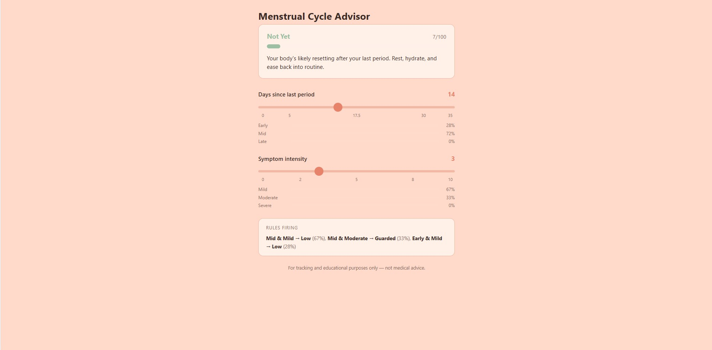

## About

Menstrual cycles aren't perfectly regular, and simple day-counting predictions don't capture that natural uncertainty. This project uses **fuzzy logic** instead of rigid cutoffs to reason in degrees — similar to how a person might say "I'm probably close" rather than "exactly 3 days left."

This is a class project built to demonstrate a fuzzy inference system (antecedents, consequent, rules, and defuzzification). **It is for tracking and educational purposes only — not a medical device, and not a substitute for professional medical advice.**

## How It Works

**Inputs (Antecedents)**
| Input | Range | Fuzzy Sets |
|---|---|---|
| Days Since Last Period | 0–35 | Early, Mid, Late |
| Symptom Intensity | 0–10 | Mild, Moderate, Severe |

All fuzzy sets use triangular membership functions with shared knot points, so each input's three memberships always sum to exactly 1.

**Output (Consequent)**
| Attention Score | 0–100 | Low, Guarded, Elevated, High |

**Inference**
- 9 rules covering every combination of the two inputs (e.g. *Late & Severe → High*)
- Fuzzy AND via minimum of the two membership values (firing strength)
- **Weighted-average defuzzification**: each fired rule contributes its output set's peak value, weighted by firing strength

```
Score = Σ(strength × peak) / Σ(strength)
```

The final crisp score is then mapped to a plain-language status (e.g. "Not Yet," "Coming Soon," "Expected Today") for display — this labeling step is separate from the fuzzy inference logic itself.

## Files

```
├── index.html   # App structure and sliders
├── style.css    # Styling
└── script.js    # Fuzzy logic: membership functions, rules, inference, UI updates
```

## Running It

No build steps or dependencies needed — just open `index.html` in a browser, or serve the folder with a local dev server (e.g. VS Code's Live Server extension).

## Preview



## Video Presentation (Midterms)

[Watch my video presentation here ](https://drive.google.com/drive/folders/14FyO6WEZeYhTouAr4blNSvJEVMC-mn6v?usp=drive_link)

## Disclaimer

For tracking and educational purposes only — not medical advice.